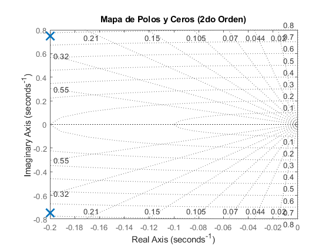
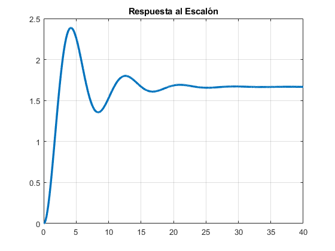

# Análisis de Sistemas de Segundo Orden: Masa-Resorte-Amortiguador

Este repositorio contiene un script de MATLAB diseñado para el modelado y análisis de la respuesta dinámica de un sistema mecánico de segundo orden. El objetivo es identificar la estabilidad del sistema mediante el mapa de polos y ceros, así como visualizar su comportamiento temporal ante una entrada escalón.

## Estructura del Código

### 1. Definición de Parámetros Físicos
Se establecen las constantes del sistema mecánico:
* **Masa (m):** 0.33 kg
* **Amortiguamiento (b):** 1 Ns/m
* **Constante elástica (k):** 1 N/m

### 2. Modelado Matemático
Se utiliza la representación en el dominio de la frecuencia ($s$) mediante una **Función de Transferencia**. La ecuación característica del sistema es:

$$H(s) = \frac{1}{ms^2 + bs + k}$$

### 3. Análisis de Estabilidad
El código calcula automáticamente:
* **Polos:** Las raíces del denominador que determinan la estabilidad y el tipo de respuesta (subamortiguada, sobreamortiguada, etc.).
* **Ceros:** Las raíces del numerador.

### 4. Visualización de Resultados
El script genera dos representaciones gráficas esenciales para validar el comportamiento del sistema:

* **Mapa de Polos y Ceros:** Permite visualizar la ubicación de las raíces en el plano complejo $s$.
    

  <h4>Mapa de Polos y Ceros</h4>
  
   
  
<i>Ubicación de las raíces en el plano complejo s para determinar la estabilidad.</i>

   

* **Respuesta al Escalón:** Muestra la evolución temporal del sistema y su estabilidad ante una entrada súbita.
    

  <h4>Respuesta al Escalón</h4>
  
   
  
<i>Evolución temporal del sistema ante una entrada unitaria.</i>

## Requisitos
* MATLAB (versión recomendada R2020a o superior).
* **Control System Toolbox** instalado.

## Uso
Para ejecutar este análisis, simplemente abre el archivo `.m` en MATLAB y presiona **Run**. Puedes modificar los valores de `m`, `b` y `k` en la sección de parámetros para observar cómo cambia la estabilidad del sistema, también puedes modificarlo para analizar sistemas de cualquier orden.

